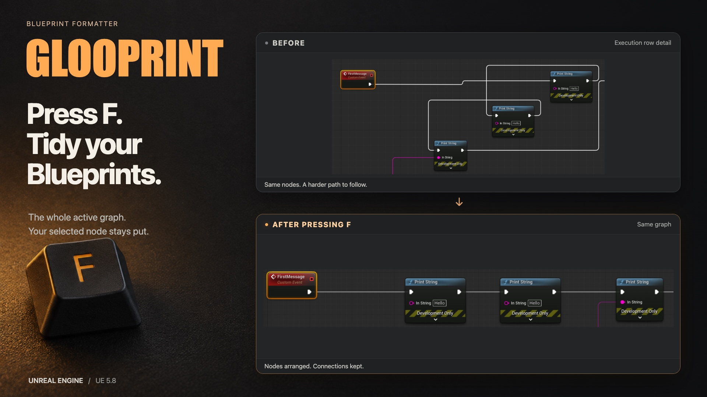

Blueprints get messy pretty quickly. GlooPrint helps with that - press **F** and it arranges the graph for you.

Select a node first if you'd like it to stay where it is. The whole active graph gets formatted around it, including groups that aren't connected. Your camera, zoom and selection stay put, so you can carry on from where you were.

Pick rounded wires, 45-degree turns or Unreal's own splines. You still get the usual pin colours, hover feedback and execution highlights. Double-click a visible wire to add a normal reroute. Your connections, pin values and existing reroutes are kept, and a changed layout can be undone in one step.

When the Fab release is available, install GlooPrint to your engine through the Epic Games Launcher. Enable it under **Edit > Plugins** and restart if prompted. Open a Blueprint graph, select a node, put the pointer over the canvas and press **F**. You can also use **GlooPrint > Format Graph** in the graph's context menu or change the shortcut in Editor Preferences > Keyboard Shortcuts.

Wire and spacing settings are under **Editor Preferences > Plugins > GlooPrint**. It starts with rounded wires, 96 horizontal spacing, 48 vertical spacing and 32 comment padding. Settings are saved for you in the current project.

Event Graphs, functions, macros, Construction Scripts, opened collapsed graphs and graphs made entirely of pure nodes are supported. An Animation Blueprint's ordinary Event Graph works too. Material graphs, animation pose graphs, Niagara, Control Rig and behaviour trees aren't supported.

Very large graphs, or nodes with lots of pins, can take minutes on the first pass and may pause the editor. Some connections use Unreal's usual curves while GlooPrint works out a route. Other formatting and wire plugins can clash with the shortcut or drawing. The [user guide](Documentation/UserGuide.txt) covers installation from source, settings, gestures and things to check if something goes wrong.

**Release candidate - UE 5.8 for Windows 64-bit and Mac.** Mac compilation has passed for Apple Silicon and Intel, with editor testing on Apple Silicon. Windows testing and large-graph performance work are still to do. Other engine versions and Linux haven't been verified.

You can grab the [1.0.0-rc1 prerelease](https://github.com/ishtms/glooprint/releases/tag/v1.0.0-rc1) to try it. Download `GlooPrint_1.0.0_rc1_UE5_8_Source.zip` for the plugin, or `GlooPrint_1.0.0_rc1_WindowsTestKit.zip` for the same source with a small test host and Windows instructions. Both need a UE 5.8 C++ toolchain. The Fab listing is still in draft.

The C++ source and guide are included. There are no extra plugins or services to sign up for. Turn GlooPrint off later and your Blueprints still work, with the saved layout and Unreal's usual wires. The cover combines artwork and actual Unreal captures. The gallery uses native graph captures with captions.

[Get help or report a bug](https://github.com/ishtms/glooprint/issues). Include your engine and plugin versions, OS and a small example that shows what's going wrong.

For release work, see the [submission checklist](Submission/Checklist.txt) and [Windows test guide](Submission/WindowsTesting.txt). Run `python3 Scripts/PrepareRelease.py --output /path/to/new/output --engine-root /path/to/UE_5.8` to make a source ZIP and run a strict packaging build on your machine. Python is only needed for this helper, not to use the plugin from Fab.
