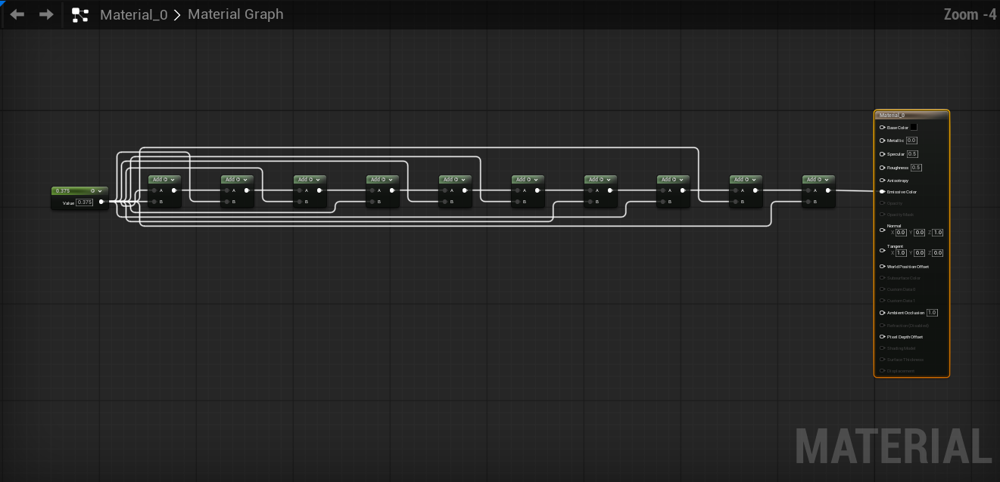

# Material graph validation — UE 5.8.2 / Windows

This change adds graph formatting and custom wires for Materials, Material Functions,
Material Layers, Layer Blends and opened material composite graphs. Material/function
instances retain Unreal's parameter editors. The 300-node cold-format and maximum
work-slice targets remain release acceptance gaps; do not describe this change as
having passed the complete performance plan. Mac validation is pending.

## Implementation

- A graph adapter centralizes graph eligibility, owners, material execution/data
  pins, ordinary reroutes, hidden pins, anchors and expression-backed coordinates.
- Capture retains the entire reciprocal connection topology, including hidden
  connected pins. Only measured visible endpoints enter visual layout/routing.
  Named-reroute references are preserved without creating synthetic wires.
- Native material widgets supply geometry. Cache signatures include expression
  state, called-function interfaces and material property visibility. Relevant
  notifications invalidate affected graphs while retaining unchanged measurements.
- Application validates the graph and expression state before one undo transaction.
  Nodes, expressions, result coordinates and comment bounds move together. Native
  MaterialDirtyDelegate integration preserves Apply/Save. Layout application bypasses
  UMaterialExpression::Modify's preview-regeneration side effect, without relinking
  expressions or calling shader compilation.
- Material and Blueprint policies share route painting and hit testing. The material
  policy uses exported UE APIs for native colors, inactive inputs, Substrate,
  execution pins, reroute directions and tooltips. Per-panel factories take precedence
  over Unreal's global material factory without private MaterialEditor includes.
  Native style delegates to Unreal. Shutdown releases owned registrations and leaves
  subsequently installed foreign factories intact.
- Escape, graph edits, reconstruction, settings changes and closed editors cancel
  pending work. Settled material layouts reuse geometry/routes and create no new
  transaction on repeat formatting.

## Environment and method

Windows 11 Pro build 26200; AMD Ryzen 9 3900X (12 cores / 24 threads), 32 GB RAM,
NVIDIA RTX 3080 Ti, driver 32.0.16.1714. UE 5.8.2, changelist 56702186.
Native builds use MSVC 14.50.35737 and Windows SDK 10.0.26100.0.
The WMI AdapterRAM field in the raw hardware record is truncated to 32 bits and
should not be used as a GPU memory measurement.

Fixtures are created through native Unreal material/expression APIs and opened in
the real Material Editor. The functional fixtures use all four asset families.
Benchmark fixtures contain a long arithmetic chain, a heavily shared constant,
function calls, custom expressions with eight inputs, expanded previews and a
containing comment. The 300-node fixture has 637 visible connections. Cold runs
invalidate GlooPrint's measurement and route caches; repeat runs preserve them.
Asset opening and initial shader compilation occur before command timing starts.
Command time ends only after layout and routing finish. Cached paint timing includes
policy construction and Draw with all connections visible, with three warmups
excluded from the 20 measured samples. It excludes Slate submission and GPU rendering.

The final-capture hit/miss columns describe route validation after layout, not the
initial cold measurement pass. Raw work-slice CSVs include the atomic validation,
transaction and graph notification work; those costs are not hidden from acceptance.

## Verification

The focused material suite passed 13 tests with normal editor shutdown. It covers
native F and node context-menu invocation, selected anchors, camera/zoom/selection,
one-step layout undo/redo, no-op repeat formatting, native Apply and Save, all four
asset families, ordered function outputs, nested composite isolation, named and
ordinary reroutes, hidden connected pins, attributes, comments, function-interface
cache invalidation, many-pin custom nodes, stale plans and malformed links.

Both custom wire styles passed native hover/marking, double-click reroute, Alt-click
disconnect, Control reconnection and undo, zoom changes, pin reconstruction and
editor-close route cleanup. Native policy appearance is compared directly to Unreal.
The foreign-factory ownership regression passed.

Rendered previews before formatting and after native undo/redo/Apply match within
0.128/255 mean RGB error across all four families, with Substrate both disabled and
enabled. Disposable test viewports disable
auto exposure, temporal antialiasing and motion blur for reproducible comparisons;
their original show flags are restored afterward. Applied fixtures compile without
errors. This image check supplements serialized expression/reference/connection
invariants; it does not substitute for them.

A fresh project without GlooPrint loaded and recompiled all four saved assets.
Expression names/classes, positions and connections matched saved metadata before
and after compilation. The editor exited normally.

The installed-engine UAT `BuildPlugin -Rocket -StrictIncludes` build passed. The
last package build recorded that all 61 packaged source files matched the
working tree at that point; see [FinalPackageBuild.json](FinalPackageBuild.json) and its
[build log](FinalPackageBuild.log).
The full Engine-filter run executed 98 checks: 93 passed, one
passed with warnings, and four failed. All 13 material checks passed in that run.
The failures were the existing Blueprint `DiagonalWireGestures`,
`RoundedWireGestures` and `FormatProgressCancel` checks (Windows refused native
foreground ownership), plus `SettingsAndWireStyles` (Unreal's UserInterfaceSettings
edit-condition error for `bUseCustomFontDPI`). The settings check passed in an
isolated retry; the three foreground checks remained blocked even with a visible
host. This is **not a green full regression run**. Raw records are retained in
[FullSuite.json](FullSuite.json), [FullSuiteReport.json](FullSuiteReport.json) and
[NativeInputRetry.json](NativeInputRetry.json).

An initial combined run also exposed forced global GC in the new test cleanup
collecting an unrelated Entry-world subsystem. Cleanup now lets the editor own
world teardown; that error did not recur. Failed full-suite runs subsequently
asserted during renderer shutdown after Unreal set `GIsCriticalError` for failed
automation. Those exits are recorded as failures, not normal shutdown passes.
Passing isolated material and persistence runs exited normally.

After that full suite, a material-only routing comparison was adjusted to ignore
decorative comment bounds when the routing body's size, header, pins and positions
match. Routing uses those body/header bounds, not the decorative bounds. This
retains completed routes after comment resizing and avoids a second routing job.
The final package passed the existing Blueprint planned-route reuse and module
lifecycle checks. The full 98-test run predates this final optimization.

Release ZIP creation was deliberately gated by the full editor suite and therefore
did not run. The final native package is available at
`C:/Users/hello/code/unreal/glooprint-material-package-final`, but the validation
record does not approve it for release.

The final package's Substrate-enabled run executed 15 checks: 14 passed and one
rounded-wire hover check failed. All four native asset editors passed, including
Apply/Save and preview comparison; the composite fixture explicitly logged
`Substrate enabled: true` and measured a connected Substrate Slab BSDF node.
Both wire styles passed an isolated Substrate-enabled retry with normal shutdown.
The original hover failure remains an intermittent test failure, not a clean
combined-suite pass. See [Substrate.json](Substrate.json),
[SubstrateReport.json](SubstrateReport.json) and
[SubstrateWireRetry.json](SubstrateWireRetry.json).

The release-tool Python suite passed all nine checks.

### Water sample follow-up

A subsequent real Single Layer Water material exposed a missing visibility case:
World Position's unconnected advanced Shader Offsets pin is collapsed by native
widgets. The adapter now honors that advanced-pin state. The added
`GlooPrint.Materials.AdvancedPinVisibility` regression verifies collapsed and
expanded geometry and cache invalidation. It passed with normal shutdown after a
native Windows rebuild. The water material formatted through F, applied, saved and
rendered successfully.

The package hashes and benchmark results below predate this small visibility fix;
they are retained as the measured snapshot, not presented as a new full-suite or
benchmark run of the follow-up source.

## Final Windows measurements

These results use the final strict-build package. Each 50/150/300-node fixture has
20 cold samples and 20 repeat samples; p95 uses the nearest-rank statistic. The
1,000-node row is one stress sample and carries no speed acceptance claim.

| Nodes | Cold p95 | Repeat p95 | Slice p95 | Longest slice | Route fallbacks |
| ---: | ---: | ---: | ---: | ---: | ---: |
| 50 | 1,507.32 ms | 5.71 ms | 14.36 ms | 87.06 ms | 21 |
| 150 | 3,714.14 ms | 16.25 ms | 10.78 ms | 218.33 ms | 118 |
| 300 | 6,877.78 ms | 26.97 ms | 5.61 ms | 334.80 ms | 288 |
| 1,000 | 29,171.57 ms | 61.82 ms | 5.50 ms | 1,193.58 ms | 1,093 |

At 300 nodes, repeat formatting and overall p95 slice time meet their targets;
cold formatting and the longest uninterrupted slice do not. The smaller fixtures
also miss their slice targets. Atomic state validation, transaction recording and
native graph refresh still produce long slices despite the cooperative work budget.

Cached wire-policy construction and drawing measured **0.854 ms p95** across 20
samples with **637 visible connections**, meeting the 2 ms target. Idle painting
did not restart routing. Every cold formatting sample reused its completed layout
routing plan after application; every repeat changed zero nodes and created no
transaction. Final validation capture recorded N-1 cache hits and one resized
comment miss after a cold format, then N hits and zero misses on repeat.

Fallbacks are visible simple paths retained when the router cannot find a clear
path; they are reported, not dropped connections. Their high counts in these
long-chain/shared-input fixtures remain a routing-quality limitation.

The benchmark test deliberately reports failed thresholds as test failures. All
samples completed, and the 1,000-node case passed completion and Escape cancellation
without graph changes or a transaction. The failed acceptance cases caused Unreal's
SoftQuit critical-error teardown path, so this combined run is not evidence of
normal shutdown. A separate final-package stress-only run passed the 1,000-node
completion, cancellation, route-plan reuse and repeat-stability checks, then
released its native editor and exited normally with code 0. See
[Stress/TestRecord.json](Stress/TestRecord.json) and
[Stress/Report.json](Stress/Report.json).

Raw timings, per-slice measurements, cache counts, process-counter snapshots and
acceptance flags are in [FinalBenchmarks/Summary.json](FinalBenchmarks/Summary.json)
and [FinalBenchmarks/Report.json](FinalBenchmarks/Report.json). An earlier baseline
is retained in `BaselineBenchmarks`; it predates the comment-route reuse fix and
included another Unreal editor consuming about six CPU cores. Process-counter
snapshots may retain recently exited processes. These runs are not a controlled
before/after comparison or a claim of an otherwise idle benchmark host.

## Remaining acceptance work

- Cold-format and longest-slice performance targets are not met, as detailed
  above; the result is not performance acceptance.
- Native material slicing and node-drag preview behavior still need their complete
  interaction matrix. Shared route hit testing supports native slicing, but the
  passing material gesture checks do not exercise an Alt-drag slice.
- Composite isolation is tested with native material graph objects and widgets;
  opening every nested composite through editor navigation is not automated here.
- Per-panel policy precedence avoids global factory ordering, and ownership on
  shutdown is tested. Both explicit MaterialEditor module-load orders still need
  independent editor runs.
- The full Blueprint suite needs a clean desktop run, including the three native
  foreground tests and the combined-suite settings error described above.
- Mac build/editor validation remains pending.

## Captures

Captured from the native editor after formatting:



[Function graph](12-Family1-NativeEditor.png),
[Layer graph](12-Family2-NativeEditor.png),
[Blend graph](12-Family3-NativeEditor.png).
Each family also has `PreviewBefore.png` and `PreviewAfter.png` captures alongside
this report. These are real editor captures, not generated illustrations.

## Reproduction

From a Windows desktop with UE 5.8.2 installed:

```powershell
python Scripts/PrepareRelease.py --output C:/Temp/GlooPrintRelease --engine-root 'C:/Program Files/Epic Games/UE_5.8' --run-editor-tests
python Tests/RunEditorTests.py --engine-root 'C:/Program Files/Epic Games/UE_5.8' --plugin C:/Temp/GlooPrintRelease/BuildWin64 --output C:/Temp/GlooPrintMaterialPerf --tests GlooPrint.Performance.Materials --test-filter Perf --timeout 1800
python Tests/SummarizeMaterialBenchmarks.py C:/Temp/GlooPrintMaterialPerf/HostProject/Saved/GlooPrintMaterials --output C:/Temp/GlooPrintMaterialPerf/Summary.json
```

For Substrate, repeat the material suite in a fresh output directory with
`--editor-arg=-ini:Engine:[/Script/Engine.RendererSettings]:r.Substrate=1`.
The test log explicitly records whether Substrate is enabled; do not infer it from
the test name. The ordinary project defaults to Substrate disabled.

Run stress independently with `--tests GlooPrint.Performance.Materials.1000
--test-filter Perf`; do not count a failed acceptance run's critical-error exit as
a successful normal-shutdown check.

For disabled-plugin persistence, copy the generated NativeEditor `.uasset`,
`.expressions.csv` and `.asset.txt` files into a fresh project's `Content/Materials`,
enable PythonScriptPlugin and EditorScriptingUtilities, leave GlooPrint absent,
and run `Tests/verify_material_disabled_startup.py` via `-ExecutePythonScript`.
The script emits `material-verification.json` and never saves over the fixtures.

Mac release acceptance requires the existing strict build and native editor checks
on a Mac host. No Mac build or editor result is claimed here.
